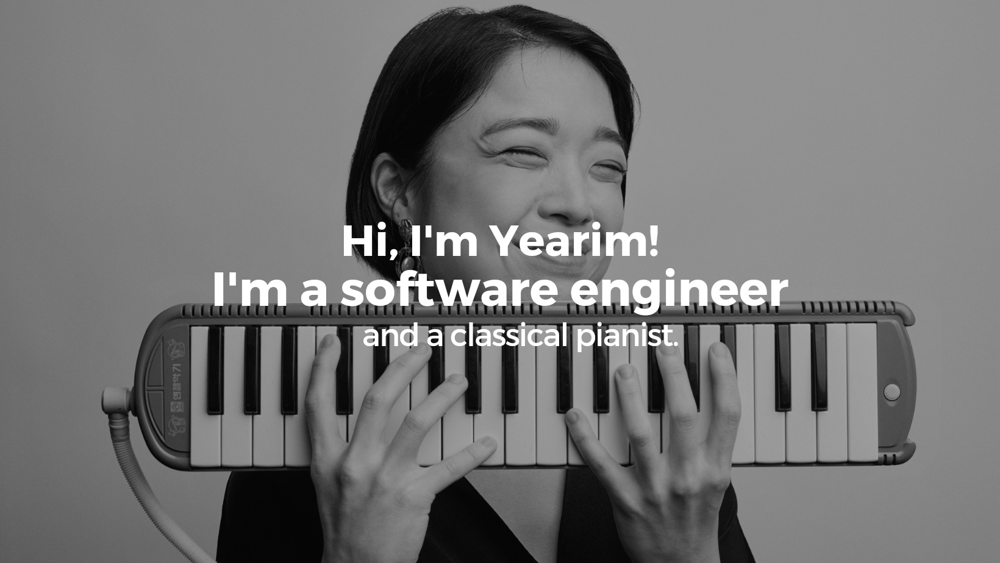

<h1> Hello, Fellow Developers!</h1>

 My name is Yearim Leslie Yi. Thank You for taking the time to view my GitHub Profile!

<h2> About Me </h2>

- 💻 Software Engineer at <a href = "https://www.teladoc.com/">Teladoc Health Inc</a>
- 🏫 <a href = "https://flatironschool.com/">Flatiron School</a>, New York
- 🎓 MM at <a href = "https://www.msmnyc.edu/"> Manhattan School of Music</a>
- 🎓 BM at <a href = "https://music.fsu.edu/">Florida State Univeristy</a>

- 📚 I'm a South Korean-American classical pianist and a full-stack developer. With seven years of experience in teaching and managing concert halls, I bring systematic skills to projects with a desire that invokes creativity. I look forward to work in a fast-paced, diverse work environment that values my persistence and quick ability to learn.

<h2> Skills </h2>
  
  
  
  

  
  
  
  
  
  
  

<h2> Connect with me </h2>
 

